# 📖 QRSeva — Implementation Documentation

> **A product of Socketix Labs Pvt. Ltd.**

Complete implementation documentation for QRSeva — a subscription-based SaaS platform for QR-based restaurant ordering, billing, and operations management. Designed for the Indian SMB restaurant market.

---

## 📂 Documentation Structure

| # | Document | Description |
|---|----------|-------------|
| 0 | [Phase 0 — Project Overview & Architecture](./phase-0-overview-architecture.md) | Vision, architecture, tech stack, system design |
| 1 | [Phase 1 — Firebase Setup & Data Models](./phase-1-firebase-data-models.md) | Firebase project config, Firestore/RTDB schemas, security rules |
| 2 | [Phase 2 — Auth & Sales Dashboard](./phase-2-auth-sales-dashboard.md) | Authentication flows, sales team management, subscription activation |
| 3 | [Phase 3 — Restaurant Admin Dashboard](./phase-3-admin-dashboard.md) | Admin panel, menu management, settings |
| 4 | [Phase 4 — Customer Ordering (QR Flow)](./phase-4-customer-ordering.md) | Guest ordering, QR scanning, menu browsing, cart & checkout |
| 5 | [Phase 5 — KDS, Orders & Real-time](./phase-5-kds-orders-realtime.md) | Kitchen display, order lifecycle, real-time updates |
| 6 | [Phase 6 — Billing, Payments & Subscriptions](./phase-6-billing-payments.md) | Digital bills, payment integrations, subscription enforcement |
| 7 | [Phase 7 — Reports, Analytics & Add-ons](./phase-7-reports-analytics.md) | Precomputed reports, analytics dashboards, combo/loyalty |
| 8 | [Phase 8 — Landing Page & Public Website](./phase-8-landing-page.md) | Marketing site, pricing, legal pages |
| 9 | [Phase 9 — Security, Testing & Deployment](./phase-9-security-testing-deployment.md) | Security hardening, test strategy, CI/CD, go-live |
| — | [Design System & Color Theme](./design-system.md) | Brand colors, typography, component guidelines |

---

## 🏗️ Implementation Order

```mermaid
graph LR
    P0[Phase 0: Architecture] --> P1[Phase 1: Firebase & Data]
    P1 --> P2[Phase 2: Auth & Sales]
    P2 --> P3[Phase 3: Admin Dashboard]
    P3 --> P4[Phase 4: Customer QR Flow]
    P4 --> P5[Phase 5: KDS & Real-time]
    P5 --> P6[Phase 6: Billing & Payments]
    P6 --> P7[Phase 7: Reports & Analytics]
    P7 --> P8[Phase 8: Landing Page]
    P8 --> P9[Phase 9: Security & Deployment]
```

Each phase is designed to be independently testable and deployable.

---

## ⏱️ Estimated Timeline

| Phase | Duration | Cumulative |
|-------|----------|------------|
| Phase 0–1 | 1 week | Week 1 |
| Phase 2 | 1.5 weeks | Week 2–3 |
| Phase 3 | 2 weeks | Week 3–5 |
| Phase 4 | 2 weeks | Week 5–7 |
| Phase 5 | 1.5 weeks | Week 7–8 |
| Phase 6 | 1.5 weeks | Week 8–10 |
| Phase 7 | 1.5 weeks | Week 10–11 |
| Phase 8 | 1 week | Week 11–12 |
| Phase 9 | 1 week | Week 12–13 |

**Total: ~13 weeks** (single developer) / **~8 weeks** (2-person team)

---

## 🎨 Brand Identity

| Element | Value |
|---------|-------|
| **Product** | QRSeva — Restaurant Solutions |
| **Company** | Socketix Labs Pvt. Ltd. |
| **Primary Color** | Maroon `#8B1A1A` |
| **Accent Color** | Amber `#F5A623` |
| **Success Color** | Green `#4CAF50` |
| **Text Color** | Dark Gray `#333333` |
| **Logo** | `Logo/QR seva_Transparent_Full.png` |
| **Favicon** | `Logo/favicon_logo.png` |
| **Company Logo** | `Logo/socketix_labs.png` |

---

## 🔑 Key Principles

1. **Simplicity First** — No overengineering; keep it SMB-friendly
2. **Subscription-Gated** — Every feature is controlled by plan
3. **Guest Checkout** — Zero friction for customers (no login)
4. **Firebase Native** — No separate servers, VMs, or containers
5. **India First** — INR pricing, UPI support, Indian restaurant workflows
6. **Cost Efficient** — Minimize Firebase reads/writes, precompute reports
