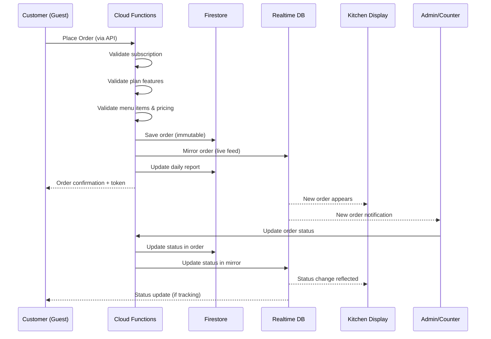

# Phase 0 — Project Overview & Architecture

> **QRSeva** — A product of **Socketix Labs Pvt. Ltd.**

---

## 1. Product Vision

QRSeva is a **subscription-based SaaS platform** that provides Indian SMB restaurants with:

- **QR-based digital ordering** (dine-in, takeaway, delivery)
- **Counter & kitchen operations** (KDS, order tokens, status tracking)
- **Digital billing** (basic receipts to full restaurant bills)
- **Reports & analytics** (daily summaries to advanced insights)

### What QRSeva is NOT

| ❌ Not This | ✅ QRSeva Is |
|-------------|-------------|
| Food delivery marketplace (Swiggy/Zomato) | Direct restaurant-to-customer ordering |
| Commission-based platform | Flat subscription pricing |
| Hardware POS system | Web-based PWA solution |
| Multi-user staff management | Single admin/counter model |

---

## 2. System Architecture

```
┌─────────────────────────────────────────────────────────────────┐
│                        CLIENTS (Browser)                        │
├──────────┬──────────┬──────────┬──────────┬────────────────────┤
│ Customer │  Admin   │  Sales   │   KDS    │   Landing Page     │
│   PWA    │Dashboard │Dashboard │  Screen  │   (Public)         │
├──────────┴──────────┴──────────┴──────────┴────────────────────┤
│                     React / Next.js Frontend                    │
└─────────────────────────┬───────────────────────────────────────┘
                          │ HTTPS
                          ▼
┌─────────────────────────────────────────────────────────────────┐
│               Firebase Cloud Functions (Node.js/TS)             │
│  ┌──────────┐ ┌──────────┐ ┌──────────┐ ┌────────────────────┐│
│  │  Order   │ │  Auth    │ │  Sub.    │ │   Reporting        ││
│  │  Engine  │ │  Handler │ │  Guard   │ │   Engine           ││
│  └────┬─────┘ └────┬─────┘ └────┬─────┘ └────────┬───────────┘│
└───────┼────────────┼────────────┼─────────────────┼────────────┘
        │            │            │                 │
        ▼            ▼            ▼                 ▼
┌──────────────┐  ┌──────────┐  ┌──────────────────────────────┐
│   Firestore  │  │ Firebase │  │  Firebase Realtime Database   │
│  (Source of  │  │   Auth   │  │  (Live updates: KDS, status) │
│   Truth)     │  │          │  │                              │
└──────────────┘  └──────────┘  └──────────────────────────────┘
```

### Architecture Principles

1. **Clients NEVER write directly to Firestore** — All writes go through Cloud Functions
2. **Firestore = business truth** — Canonical data store for all business data
3. **RTDB = live mirror only** — Used exclusively for real-time UI updates (KDS, order status)
4. **Orders are immutable** — Only status field can be updated after creation
5. **Reports are precomputed** — No raw aggregation queries at read time
6. **Tenant isolation** — All data scoped by `restaurantId`

---

## 3. Technology Stack

### Backend

| Component | Technology | Purpose |
|-----------|-----------|---------|
| Compute | Firebase Cloud Functions (Node.js 20 / TypeScript) | All business logic, API endpoints |
| Primary DB | Cloud Firestore | Orders, menus, restaurants, subscriptions, payments |
| Real-time DB | Firebase Realtime Database | Live order feeds for KDS, live status updates |
| Auth | Firebase Authentication | Admin login, sales team login |
| Storage | Firebase Cloud Storage | Menu item images, restaurant logos |
| Hosting | Firebase Hosting | Static frontend deployment |

### Frontend

| Component | Technology | Purpose |
|-----------|-----------|---------|
| Framework | React 18+ / Next.js 14+ | All frontend surfaces |
| Styling | Vanilla CSS (with CSS variables) | Design system, responsive layouts |
| State | React Context + useReducer | Local state management |
| Real-time | Firebase RTDB SDK | KDS live order feed |
| PWA | Service Worker + Web Manifest | Customer mobile experience |
| Build | Vite or Next.js built-in | Production bundling |

### DevOps

| Component | Technology | Purpose |
|-----------|-----------|---------|
| CI/CD | GitHub Actions | Automated testing & deployment |
| Hosting | Firebase Hosting | CDN-backed static hosting |
| Monitoring | Firebase Crashlytics + GCP Logging | Error tracking |
| Billing | GCP Billing Alerts | Cost management |

---

## 4. Application Surfaces

### 4.1 Customer Ordering PWA
- **URL pattern**: `order.qrseva.in/{restaurantId}` or `order.qrseva.in/{restaurantId}/table/{tableId}`
- **Access**: Public, no login required (guest checkout)
- **Purpose**: Browse menu, place orders for dine-in / takeaway / delivery

### 4.2 Restaurant Admin Dashboard
- **URL**: `app.qrseva.in`
- **Access**: Firebase Auth (Email OTP / Email + Password)
- **Purpose**: Menu management, order management, settings, reports
- **Model**: Single admin per restaurant (no staff accounts)

### 4.3 Kitchen Display System (KDS)
- **URL**: `app.qrseva.in/kds`
- **Access**: Same admin auth session
- **Purpose**: Display-only view of incoming orders with status updates
- **Plan**: Available on PRIME and SUPER plans only

### 4.4 Sales Dashboard (Internal)
- **URL**: `sales.qrseva.in`
- **Access**: Sales team auth (Email + Password + OTP)
- **Purpose**: Restaurant onboarding, subscription management, internal ops

### 4.5 Public Landing Page
- **URL**: `qrseva.in`
- **Access**: Public
- **Purpose**: Marketing, pricing, contact, legal pages

---

## 5. Subscription Model

```
┌────────────────────┬────────────────────┬────────────────────┐
│    LITE ₹799/mo    │   PRIME ₹1,399/mo  │   SUPER ₹1,999/mo │
├────────────────────┼────────────────────┼────────────────────┤
│ ✅ QR Menu         │ All LITE features  │ All PRIME features │
│ ✅ Takeaway        │ ✅ KDS             │ ✅ Dine-in QR      │
│ ✅ Delivery        │ ✅ Order tokens    │ ✅ Table mgmt      │
│ ✅ Menu (50 items) │ ✅ Live status     │ ✅ Full bill       │
│ ✅ Manual payments │ ✅ Item avail.     │ ✅ Adv. analytics  │
│ ✅ Pay on pickup   │ ✅ Delivery charge │ ✅ Loyalty          │
│                    │ ✅ Min order       │ ✅ Combos           │
│ ❌ KDS             │ ✅ Reports         │ ✅ Counter payment  │
│ ❌ Reports         │ ✅ Basic bill      │ ✅ Waiter pay link  │
│ ❌ Dine-in         │                    │                    │
│ ❌ Billing         │ ❌ Dine-in         │                    │
│ ❌ Combos          │ ❌ Full bill       │                    │
│ ❌ Loyalty         │ ❌ Combos          │                    │
│                    │ ❌ Loyalty         │                    │
└────────────────────┴────────────────────┴────────────────────┘

ADD-ON: Online Payment Gateway — ₹299/mo (Cashfree / Razorpay)
```

---

## 6. User Roles

| Role | Auth Method | Capabilities |
|------|-------------|-------------|
| **Customer** | None (guest) | Browse menu, place orders, track status |
| **Restaurant Admin** | Email OTP / Email+Password | Manage menu, orders, settings, view reports |
| **Sales Admin (Primary)** | Email+Password+OTP | Full sales dashboard access, manage sales users |
| **Sales User** | Email+Password+OTP | Onboard restaurants, manage subscriptions |

> **Important**: No waiter accounts, no kitchen accounts, no staff management. This is a single-admin model.

---

## 7. High-Level Data Flow

### Order Lifecycle



### Order Statuses

| Status | Description | Who Triggers |
|--------|-------------|-------------|
| `NEW` | Order just placed | System (on order creation) |
| `CONFIRMED` | Admin accepts | Admin |
| `PREPARING` | Kitchen started | Admin / KDS |
| `READY` | Ready for pickup/serve | Admin / KDS |
| `COMPLETED` | Delivered / picked up | Admin |
| `CANCELLED` | Order cancelled | Admin |

---

## 8. Project Structure (Modular Monorepo)

Each application surface is a **separate folder** with its own build pipeline, enabling independent deployment and team ownership.

```
QRSEVA_NEW/
├── Logo/                              # Brand assets
│   ├── QR seva_Transparent_Full.png
│   ├── QR seva_full_logo.png
│   ├── favicon_logo.png
│   └── socketix_labs.png
├── docs/                              # This documentation
│
├── sales-dashboard/                   # 🔲 Sales Admin Panel (Phase 2)
│   ├── src/
│   │   ├── pages/                     # Login, Dashboard, Restaurants,
│   │   │                              # Subscriptions, Team, AuditLogs,
│   │   │                              # DatabaseViewer, Notifications
│   │   ├── components/                # Sales-specific UI components
│   │   ├── hooks/                     # Custom hooks
│   │   ├── context/                   # Auth, notification context
│   │   ├── services/                  # API calls to Cloud Functions
│   │   └── styles/
│   ├── public/
│   ├── vite.config.ts
│   └── package.json
│
├── admin-dashboard/                   # 🍽️ Restaurant Admin Panel (Phase 3)
│   ├── src/
│   │   ├── pages/                     # Login, SetupWizard, Dashboard,
│   │   │                              # Orders, Menu, KDS, Reports,
│   │   │                              # Combos, Loyalty, Tables,
│   │   │                              # Announcements, Settings
│   │   ├── components/                # PlanGate, OrderCard, MenuItemForm...
│   │   ├── hooks/
│   │   ├── context/                   # Auth, Restaurant, Order, Onboarding
│   │   ├── services/
│   │   └── styles/
│   ├── public/
│   ├── vite.config.ts
│   └── package.json
│
├── customer-app/                      # 📱 Customer Ordering PWA (Phase 4)
│   ├── src/
│   │   ├── pages/                     # Menu, Cart, Checkout,
│   │   │                              # OrderConfirmation, Tracking, Feedback
│   │   ├── components/                # MenuItem, CartBar, DietaryFilters,
│   │   │                              # LanguageToggle, AnnouncementBanner
│   │   ├── hooks/
│   │   ├── context/                   # Cart, Restaurant context
│   │   ├── services/
│   │   ├── styles/
│   │   └── sw.ts                      # Service Worker (PWA + Push)
│   ├── public/
│   │   ├── manifest.json
│   │   └── icons/
│   ├── vite.config.ts
│   └── package.json
│
├── restaurant-website/                # 🌐 Restaurant Public Page (optional)
│   ├── src/                           # Per-restaurant SEO-friendly menu view
│   ├── public/
│   ├── vite.config.ts
│   └── package.json
│
├── landing-page/                      # 🏠 QRSeva Marketing Website (Phase 8)
│   ├── src/
│   │   ├── pages/                     # Home, Features, Pricing, Contact,
│   │   │                              # Demo, Signup, Terms, Privacy, Refund
│   │   ├── components/
│   │   └── styles/
│   ├── public/
│   ├── vite.config.ts
│   └── package.json
│
├── packages/                          # 📦 Shared code across all apps
│   ├── shared-ui/                     # Reusable UI: Button, Modal, Loader, Toast
│   ├── shared-types/                  # TS interfaces: Order, Restaurant, Menu...
│   ├── firebase-config/               # Firebase init, auth helpers
│   └── utils/                         # Formatters, validators, constants
│
├── functions/                         # ⚡ Firebase Cloud Functions (Backend)
│   ├── src/
│   │   ├── orders/                    # Order CRUD & validation
│   │   ├── auth/                      # Auth triggers & custom claims
│   │   ├── subscriptions/             # Subscription enforcement
│   │   ├── menus/                     # Menu management
│   │   ├── reports/                   # Report generation
│   │   ├── sales/                     # Sales operations
│   │   ├── payments/                  # Payment processing
│   │   ├── billing/                   # Bill generation & GST
│   │   ├── coupons/                   # Coupon validation
│   │   ├── feedback/                  # Customer feedback
│   │   ├── notifications/             # Email & push notifications
│   │   ├── admin/                     # Database viewer, analytics
│   │   ├── middleware/                # Rate limiting, validation
│   │   └── utils/                     # Shared utilities
│   ├── package.json
│   └── tsconfig.json
│
├── firestore.rules                    # Firestore security rules
├── database.rules.json                # RTDB security rules
├── firebase.json                      # Firebase config (multi-site hosting)
├── .firebaserc                        # Firebase project alias
├── package.json                       # Root workspace config
└── turbo.json                         # Turborepo build orchestration (optional)
```

### 8.1 Multi-Site Netlify Hosting

Each app deploys to a separate Netlify site (see [Deployment Documentation](./deployment.md) for full setup):

| App | Firebase Site | Custom Domain |
|-----|---------------|---------------|
| Landing Page | `qrseva-landing` | `qrseva.in` |
| Admin Dashboard | `qrseva-admin` | `admin.qrseva.in` |
| Sales Dashboard | `qrseva-sales` | `sales.qrseva.in` |
| Customer App | `qrseva-order` | `order.qrseva.in` |
| Demo | `qrseva-demo` | `demo.qrseva.in` |

### 8.2 Shared Packages

All apps import from `packages/` for consistency:

```typescript
import { Button, Modal } from '@qrseva/shared-ui';
import { Order, Restaurant } from '@qrseva/shared-types';
import { firebaseApp } from '@qrseva/firebase-config';
import { formatPrice, formatDate } from '@qrseva/utils';
```

---

## 9. Non-Functional Requirements

| Requirement | Target |
|-------------|--------|
| Page load time | < 2s on 4G |
| Order placement | < 3s end-to-end |
| KDS update latency | < 500ms |
| Uptime | 99.5% (Firebase SLA) |
| Concurrent restaurants | 500+ |
| Orders per restaurant/day | Up to 500 |
| Data retention | 12 months minimum |
| Mobile responsive | All screens |
| Browser support | Chrome, Safari, Firefox (latest 2 versions) |

---

## 10. Cost Optimization Strategy

| Strategy | Implementation |
|----------|---------------|
| **Minimize Firestore reads** | Cache menu data aggressively, use RTDB for live feeds |
| **Precompute reports** | Update counters on write, never aggregate on read |
| **Batch writes** | Use Firestore batch operations where possible |
| **RTDB for live data** | Cheaper for frequent small reads (KDS polling) |
| **Image optimization** | Compress menu images, use WebP format |
| **Function cold starts** | Keep functions warm with scheduled pings |
| **GCP billing alerts** | Set alerts at ₹500, ₹1000, ₹2500, ₹5000 |

---

> **Next Phase**: [Phase 1 — Firebase Setup & Data Models →](./phase-1-firebase-data-models.md)
