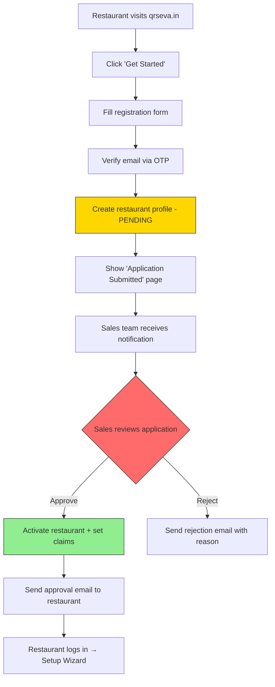

# Phase 2 — Authentication & Sales Dashboard

---

## 1. Authentication Architecture

### 1.1 Auth Strategy Overview

| User Type | Auth Method | Firebase Auth Provider | Custom Claims |
|-----------|-------------|----------------------|---------------|
| Customer | None (guest) | N/A | N/A |
| Restaurant Admin | Email OTP / Email+Password | Email/Password + Email Link | `{ role: 'RESTAURANT_ADMIN', restaurantId: '...' }` |
| Sales Admin | Email+Password+OTP | Email/Password + Email Link | `{ role: 'SALES_ADMIN' }` |
| Sales User | Email+Password+OTP | Email/Password + Email Link | `{ role: 'SALES_USER' }` |

### 1.2 Custom Claims Structure

```typescript
// Set via Cloud Function (Admin SDK)
interface CustomClaims {
  role: 'RESTAURANT_ADMIN' | 'SALES_ADMIN' | 'SALES_USER';
  restaurantId?: string;  // Only for RESTAURANT_ADMIN
}
```

---

## 2. Auth Cloud Functions

### 2.1 Sales Admin Bootstrap

The primary sales admin account is created manually and bootstrapped:

```typescript
// functions/src/auth/bootstrapSalesAdmin.ts

import * as admin from 'firebase-admin';

export async function bootstrapSalesAdmin() {
  const email = 'qrsevatechnologiespvtltd@gmail.com';
  
  // Create user if not exists
  let user;
  try {
    user = await admin.auth().getUserByEmail(email);
  } catch {
    user = await admin.auth().createUser({
      email,
      password: 'QRseva@1001',
      emailVerified: true,
    });
  }
  
  // Set custom claims
  await admin.auth().setCustomUserClaims(user.uid, {
    role: 'SALES_ADMIN',
  });
  
  // Create sales_users document
  await admin.firestore().collection('sales_users').doc(user.uid).set({
    id: user.uid,
    email,
    name: 'QRSeva Admin',
    phone: '',
    role: 'SALES_ADMIN',
    isActive: true,
    mustChangePassword: true,  // Force password change on first login
    restaurantsOnboarded: 0,
    subscriptionsActivated: 0,
    createdBy: 'SYSTEM',
    createdAt: admin.firestore.FieldValue.serverTimestamp(),
    updatedAt: admin.firestore.FieldValue.serverTimestamp(),
  }, { merge: true });
}
```

### 2.2 Auth Middleware

```typescript
// functions/src/middleware/authMiddleware.ts

import * as admin from 'firebase-admin';
import { Request, Response, NextFunction } from 'express';

export function requireAuth(allowedRoles: string[]) {
  return async (req: Request, res: Response, next: NextFunction) => {
    const token = req.headers.authorization?.split('Bearer ')[1];
    if (!token) {
      return res.status(401).json({ error: 'No token provided' });
    }
    
    try {
      const decoded = await admin.auth().verifyIdToken(token);
      
      if (!allowedRoles.includes(decoded.role)) {
        return res.status(403).json({ error: 'Insufficient permissions' });
      }
      
      req.user = decoded;
      next();
    } catch (error) {
      return res.status(401).json({ error: 'Invalid token' });
    }
  };
}

export function requireSalesAuth() {
  return requireAuth(['SALES_ADMIN', 'SALES_USER']);
}

export function requireSalesAdminAuth() {
  return requireAuth(['SALES_ADMIN']);
}

export function requireRestaurantAuth() {
  return requireAuth(['RESTAURANT_ADMIN']);
}
```

### 2.3 Password Change Enforcement

```typescript
// functions/src/auth/changePassword.ts

export const changePassword = functions.https.onCall(async (data, context) => {
  if (!context.auth) throw new functions.https.HttpsError('unauthenticated', 'Login required');
  
  const { currentPassword, newPassword } = data;
  
  // Validate password strength
  if (newPassword.length < 8 || !/[A-Z]/.test(newPassword) || !/[0-9]/.test(newPassword)) {
    throw new functions.https.HttpsError('invalid-argument', 
      'Password must be 8+ chars with uppercase and number');
  }
  
  // Update password
  await admin.auth().updateUser(context.auth.uid, { password: newPassword });
  
  // Clear mustChangePassword flag
  await admin.firestore().collection('sales_users').doc(context.auth.uid).update({
    mustChangePassword: false,
    updatedAt: admin.firestore.FieldValue.serverTimestamp(),
  });
  
  return { success: true };
});
```

---

## 3. Sales Dashboard — Features

### 3.1 Dashboard Home

**Route**: `/sales/dashboard`

| Metric | Description |
|--------|-------------|
| Total Restaurants | Count of all restaurants |
| Active Subscriptions | Currently active subs |
| Expiring Soon | Subs expiring in 7 days |
| Revenue This Month | Total subscription payments |
| Recent Onboarding | Last 10 restaurants created |

### 3.2 Restaurant Management

**Route**: `/sales/restaurants`

#### Create Restaurant
```typescript
// functions/src/sales/createRestaurant.ts

export const createRestaurant = functions.https.onCall(async (data, context) => {
  // Verify sales role
  requireSalesRole(context);
  
  const { name, phone, email, address, adminPassword } = data;
  
  // 1. Create Firebase Auth user for restaurant admin
  const adminUser = await admin.auth().createUser({
    email,
    password: adminPassword,
    emailVerified: false,
  });
  
  // 2. Generate slug
  const slug = generateSlug(name);
  
  // 3. Create restaurant document
  const restaurantRef = admin.firestore().collection('restaurants').doc();
  const restaurantId = restaurantRef.id;
  
  await restaurantRef.set({
    id: restaurantId,
    name,
    slug,
    phone,
    email,
    address,
    isActive: false,  // Activate after subscription
    subscriptionId: null,
    currentPlan: null,
    planFeatures: getDefaultFeatures(),
    settings: getDefaultSettings(),
    createdAt: admin.firestore.FieldValue.serverTimestamp(),
    updatedAt: admin.firestore.FieldValue.serverTimestamp(),
    createdBy: context.auth.uid,
  });
  
  // 4. Set custom claims for restaurant admin
  await admin.auth().setCustomUserClaims(adminUser.uid, {
    role: 'RESTAURANT_ADMIN',
    restaurantId,
  });
  
  // 5. Log audit
  await logAudit({
    action: 'RESTAURANT_CREATED',
    performedBy: context.auth.uid,
    performedByRole: context.auth.token.role,
    targetType: 'RESTAURANT',
    targetId: restaurantId,
    details: { name, email, slug },
  });
  
  // 6. Update sales user stats
  await admin.firestore().collection('sales_users').doc(context.auth.uid).update({
    restaurantsOnboarded: admin.firestore.FieldValue.increment(1),
    updatedAt: admin.firestore.FieldValue.serverTimestamp(),
  });
  
  return { restaurantId, slug };
});
```

#### List / Search Restaurants
- Paginated list with search by name, email, phone
- Filter by plan, status (active/inactive/expired)
- Sort by creation date, name

#### View Restaurant Detail
- Full restaurant info
- Current subscription status
- Subscription history
- Order statistics (last 30 days)

### 3.3 Subscription Management

**Route**: `/sales/restaurants/{restaurantId}/subscription`

#### Activate Subscription
```typescript
// functions/src/sales/activateSubscription.ts

export const activateSubscription = functions.https.onCall(async (data, context) => {
  requireSalesRole(context);
  
  const { restaurantId, plan, duration, paymentMethod, paymentReference, addons } = data;
  
  // 1. Validate plan
  const planConfig = PLAN_CONFIG[plan];
  if (!planConfig) throw error('Invalid plan');
  
  // 2. Calculate amount
  const amount = calculateAmount(plan, duration, addons);
  
  // 3. Calculate dates
  const startDate = admin.firestore.Timestamp.now();
  const endDate = addMonths(startDate.toDate(), duration);
  const gracePeriodEnd = addDays(endDate, 3);
  
  // 4. Create subscription
  const subRef = admin.firestore().collection('subscriptions').doc();
  await subRef.set({
    id: subRef.id,
    restaurantId,
    plan,
    status: 'ACTIVE',
    startDate,
    endDate: admin.firestore.Timestamp.fromDate(endDate),
    gracePeriodEnd: admin.firestore.Timestamp.fromDate(gracePeriodEnd),
    duration,
    amount,
    addons: { onlinePayment: addons?.onlinePayment || false },
    paymentMethod,
    paymentReference,
    activatedBy: context.auth.uid,
    activatedAt: admin.firestore.FieldValue.serverTimestamp(),
    renewalCount: 0,
    createdAt: admin.firestore.FieldValue.serverTimestamp(),
    updatedAt: admin.firestore.FieldValue.serverTimestamp(),
  });
  
  // 5. Create payment record
  await createPaymentRecord(restaurantId, subRef.id, amount, paymentMethod, paymentReference, context.auth.uid);
  
  // 6. Update restaurant with plan features
  await admin.firestore().collection('restaurants').doc(restaurantId).update({
    isActive: true,
    subscriptionId: subRef.id,
    currentPlan: plan,
    planFeatures: getPlanFeatures(plan),
    updatedAt: admin.firestore.FieldValue.serverTimestamp(),
  });
  
  // 7. Audit log
  await logAudit({
    action: 'SUBSCRIPTION_ACTIVATED',
    performedBy: context.auth.uid,
    performedByRole: context.auth.token.role,
    targetType: 'SUBSCRIPTION',
    targetId: subRef.id,
    details: { restaurantId, plan, duration, amount },
  });
  
  return { subscriptionId: subRef.id };
});
```

#### Plan Pricing Matrix

```typescript
const PLAN_PRICING = {
  LITE: {
    1: 79900,    // ₹799
    3: 215700,   // ₹2,157 (10% off)
    6: 383400,   // ₹3,834 (20% off)
    12: 671160,  // ₹6,711.60 (30% off)
  },
  PRIME: {
    1: 139900,   // ₹1,399
    3: 377730,   // ₹3,777.30 (10% off)
    6: 671520,   // ₹6,715.20 (20% off)
    12: 1175160, // ₹11,751.60 (30% off)
  },
  SUPER: {
    1: 199900,   // ₹1,999
    3: 539730,   // ₹5,397.30 (10% off)
    6: 959520,   // ₹9,595.20 (20% off)
    12: 1679160, // ₹16,791.60 (30% off)
  },
};

const ADDON_PRICING = {
  onlinePayment: 29900, // ₹299/mo
};
```

### 3.4 Sales User Management

**Route**: `/sales/team` (Sales Admin only)

| Action | Description |
|--------|-------------|
| Create Sales User | Email, name, phone, initial password |
| Deactivate User | Soft disable access |
| View User Activity | Restaurants onboarded, subs activated |
| Reset Password | Force password reset |

### 3.5 Audit Logs

**Route**: `/sales/audit-logs` (Sales Admin only)

- Filterable by action type, user, date range
- Paginated results
- Export to CSV (future)

---

## 4. Sales Dashboard — UI Screens

### 4.1 Screen List

| Screen | Route | Access |
|--------|-------|--------|
| Login | `/sales/login` | Public |
| Force Password Change | `/sales/change-password` | Auth |
| Dashboard Home | `/sales/dashboard` | Sales |
| Restaurant List | `/sales/restaurants` | Sales |
| Create Restaurant | `/sales/restaurants/new` | Sales |
| Restaurant Detail | `/sales/restaurants/:id` | Sales |
| Activate Subscription | `/sales/restaurants/:id/subscribe` | Sales |
| Subscription History | `/sales/restaurants/:id/history` | Sales |
| Team Management | `/sales/team` | Admin |
| Create Sales User | `/sales/team/new` | Admin |
| Audit Logs | `/sales/audit-logs` | Admin |
| Database Viewer | `/sales/database` | Admin |
| Settings | `/sales/settings` | Admin |

### 4.2 UI Layout

```
┌──────────────────────────────────────────────────────┐
│  🔲 QRSeva Sales Dashboard          [User ▼] [Logout]│
├──────────┬───────────────────────────────────────────┤
│          │                                           │
│ 📊 Home  │   [Main Content Area]                     │
│ 🏪 Rest. │                                           │
│ 👥 Team  │                                           │
│ 📋 Logs  │                                           │
│ 🗃️ DB View│  ← Admin only                           │
│ ⚙️ Setup │                                           │
│          │                                           │
└──────────┴───────────────────────────────────────────┘
```

---

## 4.3 Database Viewer (Admin Only)

**Route**: `/sales/database`  
**Access**: `SALES_ADMIN` only  
**Purpose**: View and inspect Firebase data without using the Firebase Console directly.

> ⚠️ **Read-only access only** — No writes, updates, or deletes allowed from this interface. All data access is routed through Cloud Functions with admin authentication.

### Features

| Feature | Description |
|---------|-------------|
| **Collection Browser** | Browse all Firestore collections with pagination |
| **Document Viewer** | View individual document fields with type indicators |
| **RTDB Viewer** | Browse Realtime Database nodes (live_orders, etc.) |
| **Query Builder** | Filter documents by field, operator, value |
| **Restaurant Scoping** | Quick filter to view data for a specific restaurant |
| **JSON Export** | Export selected documents/collections as JSON |
| **Search** | Full-text search across document IDs and fields |

### UI Layout

```
┌───────────────────────────────────────────────────────────────┐
│  🗃️ Database Viewer                [Firestore ▼] [RTDB]  │
├────────────────────┬──────────────────────────────────────────┤
│  Collections       │  🔍 Search...                               │
│  ───────────────  │  Restaurant: [All ▼] [Filter]                │
│  ▶ restaurants      │  ──────────────────────────────────────  │
│  ▶ menus            │  Document: abc123xyz                        │
│  ▼ orders           │  ──────────────────────────────────────  │
│    ORD-20260210-001 │  restaurantId: "rest_abc"     (string)   │
│    ORD-20260210-002 │  status: "COMPLETED"          (string)   │
│    ORD-20260210-003 │  totalAmount: 66000            (number)   │
│  ▶ subscriptions    │  customer: {                   (map)      │
│  ▶ payments         │    name: "Rahul Kumar"                    │
│  ▶ sales_users      │    phone: "9876543210"                    │
│  ▶ audit_logs       │  }                                       │
│  ▶ coupons          │  placedAt: 2026-02-10T12:30:00 (timestamp)│
│  ▶ feedback         │  items: [...]                  (array)   │
│  ▶ announcements    │                                          │
│  ───────────────  │  [Export JSON]  [Copy ID]                  │
│  Page 1 of 12      │                                          │
└────────────────────┴──────────────────────────────────────────┘
```

### Query Builder

```
┌──────────────────────────────────────────┐
│  Query Builder                               │
├──────────────────────────────────────────┤
│  Collection: [orders ▼]                       │
│  Field:      [status_________]                │
│  Operator:   [== ▼]                            │
│  Value:      [COMPLETED______]                │
│  [+ Add Filter]                               │
│  Order by:   [placedAt ▼] [▼ DESC]             │
│  Limit:      [25____]                         │
│                                               │
│  [Run Query]  Results: 142 documents           │
└──────────────────────────────────────────┘
```

### Cloud Function for Data Access

```typescript
// functions/src/admin/databaseViewer.ts

export const queryFirestore = functions.https.onCall(async (data, context) => {
  // 1. Require SALES_ADMIN role
  requireSalesAdmin(context);
  
  const { collection, subcollection, parentDocId, filters, orderBy, limit, startAfter } = data;
  
  // 2. Validate collection name (whitelist allowed collections)
  const allowedCollections = [
    'restaurants', 'menus', 'orders', 'subscriptions', 'payments',
    'sales_users', 'audit_logs', 'reports_daily', 'reports_monthly',
    'coupons', 'feedback', 'announcements', 'delivery_zones',
    'subscription_invoices', 'loyalty_accounts',
  ];
  
  if (!allowedCollections.includes(collection)) {
    throw error('Access to this collection is not permitted');
  }
  
  // 3. Build query
  let query: FirebaseFirestore.Query = admin.firestore().collection(collection);
  
  // Handle subcollections (e.g., menus/{restaurantId}/items)
  if (subcollection && parentDocId) {
    query = admin.firestore()
      .collection(collection)
      .doc(parentDocId)
      .collection(subcollection);
  }
  
  // Apply filters
  if (filters && filters.length > 0) {
    for (const filter of filters) {
      query = query.where(filter.field, filter.operator, filter.value);
    }
  }
  
  // Apply ordering & pagination
  if (orderBy) {
    query = query.orderBy(orderBy.field, orderBy.direction || 'desc');
  }
  
  query = query.limit(Math.min(limit || 25, 100)); // Max 100 docs per page
  
  if (startAfter) {
    const startDoc = await admin.firestore().collection(collection).doc(startAfter).get();
    if (startDoc.exists) query = query.startAfter(startDoc);
  }
  
  // 4. Execute & return
  const snapshot = await query.get();
  
  // 5. Audit log this access
  await logAudit({
    action: 'DATABASE_VIEW',
    performedBy: context.auth.uid,
    details: { collection, subcollection, filters, resultCount: snapshot.size },
  });
  
  return {
    documents: snapshot.docs.map(doc => ({ id: doc.id, data: doc.data() })),
    count: snapshot.size,
    hasMore: snapshot.size === (limit || 25),
  };
});

export const queryRTDB = functions.https.onCall(async (data, context) => {
  requireSalesAdmin(context);
  
  const { path, limit } = data;
  
  // Whitelist allowed RTDB paths
  const allowedPaths = ['live_orders', 'waiter_calls', 'order_counters'];
  const rootPath = path.split('/')[0];
  
  if (!allowedPaths.includes(rootPath)) {
    throw error('Access to this RTDB path is not permitted');
  }
  
  const snapshot = await admin.database()
    .ref(path)
    .limitToFirst(Math.min(limit || 50, 200))
    .once('value');
  
  await logAudit({
    action: 'RTDB_VIEW',
    performedBy: context.auth.uid,
    details: { path, resultCount: snapshot.numChildren() },
  });
  
  return { data: snapshot.val(), childCount: snapshot.numChildren() };
});
```

### Security Measures

| Measure | Description |
|---------|-------------|
| **Admin-only access** | Only `SALES_ADMIN` role can access |
| **Read-only** | No write/update/delete operations exposed |
| **Collection whitelist** | Only approved collections are queryable |
| **Result limit** | Max 100 documents per query, 200 RTDB nodes |
| **Audit logging** | Every view/query is logged with user, collection, filters |
| **No sensitive fields** | Passwords, API keys, secrets never returned |
| **Rate limiting** | Max 30 queries per minute per user |

---

## 5. Subscription Enforcement

### 5.1 Scheduled Check (Daily)

```typescript
// functions/src/subscriptions/checkExpiry.ts

export const checkSubscriptionExpiry = functions.pubsub
  .schedule('every 24 hours')
  .timeZone('Asia/Kolkata')
  .onRun(async () => {
    const now = admin.firestore.Timestamp.now();
    
    // Find subscriptions that just expired
    const expiredSubs = await admin.firestore()
      .collection('subscriptions')
      .where('status', '==', 'ACTIVE')
      .where('endDate', '<=', now)
      .get();
    
    for (const doc of expiredSubs.docs) {
      const sub = doc.data();
      
      if (now.toDate() <= sub.gracePeriodEnd.toDate()) {
        // In grace period
        await doc.ref.update({ status: 'GRACE', updatedAt: now });
      } else {
        // Grace period over — block access
        await doc.ref.update({ status: 'EXPIRED', updatedAt: now });
        await admin.firestore().collection('restaurants').doc(sub.restaurantId).update({
          isActive: false,
          updatedAt: now,
        });
      }
    }
    
    // Also check grace period expires
    const graceSubs = await admin.firestore()
      .collection('subscriptions')
      .where('status', '==', 'GRACE')
      .where('gracePeriodEnd', '<=', now)
      .get();
    
    for (const doc of graceSubs.docs) {
      const sub = doc.data();
      await doc.ref.update({ status: 'EXPIRED', updatedAt: now });
      await admin.firestore().collection('restaurants').doc(sub.restaurantId).update({
        isActive: false,
        updatedAt: now,
      });
    }
  });
```

### 5.2 Subscription Expiry Email Alerts

When the daily scheduler detects expiring or grace-period subscriptions, it sends email alerts to the restaurant admin and assigned sales user:

```typescript
// functions/src/subscriptions/expiryAlerts.ts

interface ExpiryAlert {
  type: 'EXPIRING_SOON' | 'ENTERED_GRACE' | 'EXPIRED';
  restaurantId: string;
  restaurantName: string;
  adminEmail: string;
  salesUserEmail: string;
  plan: string;
  endDate: Date;
  daysRemaining: number;
}

export async function sendExpiryAlerts() {
  const now = admin.firestore.Timestamp.now();
  const sevenDaysFromNow = addDays(now.toDate(), 7);
  
  // 1. Find subscriptions expiring within 7 days
  const expiringSoon = await admin.firestore()
    .collection('subscriptions')
    .where('status', '==', 'ACTIVE')
    .where('endDate', '<=', admin.firestore.Timestamp.fromDate(sevenDaysFromNow))
    .where('endDate', '>', now)
    .get();
  
  for (const doc of expiringSoon.docs) {
    const sub = doc.data();
    const restaurant = await getRestaurant(sub.restaurantId);
    const daysLeft = differenceInDays(sub.endDate.toDate(), now.toDate());
    
    // Send at 7, 3, and 1 day(s) before expiry
    if ([7, 3, 1].includes(daysLeft)) {
      await sendEmail({
        to: restaurant.email,
        subject: `⚠️ QRSeva subscription expires in ${daysLeft} day(s)`,
        template: 'subscription-expiring',
        data: { restaurantName: restaurant.name, plan: sub.plan, daysLeft, endDate: sub.endDate },
      });
      
      // Also notify assigned sales user
      const salesUser = await getSalesUser(sub.activatedBy);
      if (salesUser) {
        await sendEmail({
          to: salesUser.email,
          subject: `🔔 ${restaurant.name} subscription expiring in ${daysLeft} day(s)`,
          template: 'sales-sub-expiring',
          data: { restaurantName: restaurant.name, plan: sub.plan, daysLeft },
        });
      }
    }
  }
}
```

### 5.3 Sales Team Notifications

Sales dashboard displays real-time notification badges for important events:

| Notification Type | Trigger | Recipients |
|------------------|---------|------------|
| Subscription expiring (7 days) | Daily scheduler | Assigned sales user + admin |
| Subscription entered grace | Daily scheduler | All sales team |
| Subscription expired | Daily scheduler | Sales admin |
| New restaurant signup (self-service) | On registration | All sales team |
| Payment pending confirmation | On payment record | Sales admin |

```typescript
// functions/src/sales/salesNotifications.ts

interface SalesNotification {
  id: string;
  type: 'SUB_EXPIRING' | 'SUB_GRACE' | 'SUB_EXPIRED' | 'NEW_SIGNUP' | 'PAYMENT_PENDING';
  title: string;
  message: string;
  targetUserId?: string;         // Specific sales user, or null for all
  restaurantId: string;
  isRead: boolean;
  createdAt: Timestamp;
}
```

### 5.4 Order-Time Validation

```typescript
// functions/src/middleware/subscriptionGuard.ts

export async function validateSubscription(restaurantId: string): Promise<{
  valid: boolean;
  plan: string;
  features: PlanFeatures;
  error?: string;
}> {
  const restaurant = await admin.firestore()
    .collection('restaurants')
    .doc(restaurantId)
    .get();
  
  if (!restaurant.exists || !restaurant.data()?.isActive) {
    return { valid: false, plan: '', features: {} as PlanFeatures, 
             error: 'Restaurant is not active' };
  }
  
  const sub = await admin.firestore()
    .collection('subscriptions')
    .doc(restaurant.data()!.subscriptionId)
    .get();
  
  if (!sub.exists) {
    return { valid: false, plan: '', features: {} as PlanFeatures, 
             error: 'No subscription found' };
  }
  
  const subData = sub.data()!;
  
  if (subData.status === 'EXPIRED' || subData.status === 'CANCELLED') {
    return { valid: false, plan: subData.plan, features: {} as PlanFeatures, 
             error: 'Subscription expired' };
  }
  
  return {
    valid: true,
    plan: subData.plan,
    features: restaurant.data()!.planFeatures,
  };
}
```

---

## 6. Self-Service Restaurant Signup (Sales Approval Required)

Restaurants can register independently, but their account is **not activated until a sales admin approves** from the Sales Dashboard.

### 6.1 Signup Flow



> [!IMPORTANT]
> Restaurant accounts remain in **PENDING_APPROVAL** status until explicitly approved by a sales admin. No custom claims are set, no login is possible until approval.

### 6.2 Registration Form

| Field | Required | Validation |
|-------|----------|------------|
| Restaurant Name | ✅ | 2-100 characters |
| Owner Name | ✅ | 2-50 characters |
| Email | ✅ | Valid email format |
| Phone | ✅ | Indian mobile (10 digits, starts with 6-9) |
| City | ✅ | Dropdown + text |
| Restaurant Type | ✅ | Dropdown: Cafe, Restaurant, Cloud Kitchen, Bakery, Other |
| GSTIN (optional) | ❌ | 15-character GSTIN format |
| How did you hear about us? | ❌ | Dropdown |

### 6.3 Step 1: Self-Signup Cloud Function (Creates PENDING Restaurant)

```typescript
// functions/src/auth/selfSignup.ts

export const selfServiceSignup = functions.https.onCall(async (data) => {
  const { email, password, restaurantName, ownerName, phone, city, restaurantType } = data;
  
  // 1. Validate inputs
  const validated = selfSignupSchema.parse(data);
  
  // 2. Check for duplicate email/phone
  const existing = await admin.firestore()
    .collection('restaurants')
    .where('email', '==', email)
    .get();
  
  if (!existing.empty) {
    throw error('A restaurant with this email already exists');
  }
  
  // 3. Create Firebase Auth user (disabled until approval)
  const user = await admin.auth().createUser({
    email,
    password,
    displayName: ownerName,
    emailVerified: false,
    disabled: true,  // ⚠️ Account disabled until sales approves
  });
  
  // 4. Create restaurant with PENDING status
  const restaurantRef = admin.firestore().collection('restaurants').doc();
  const restaurantId = restaurantRef.id;
  const slug = generateSlug(restaurantName);
  
  await restaurantRef.set({
    id: restaurantId,
    name: restaurantName,
    slug,
    phone,
    email,
    address: { city },
    restaurantType,
    isActive: false,                    // ⚠️ NOT active until approved
    status: 'PENDING_APPROVAL',        // ⚠️ Pending sales approval
    currentPlan: null,                 // No plan until approved
    authUid: user.uid,                 // Link to Firebase Auth user
    signupSource: 'SELF_SERVICE',
    createdBy: 'SELF_SIGNUP',
    createdAt: admin.firestore.FieldValue.serverTimestamp(),
    updatedAt: admin.firestore.FieldValue.serverTimestamp(),
  });
  
  // 5. NO custom claims set — user cannot access admin dashboard
  
  // 6. Send "Application Received" email to restaurant
  await sendEmail({
    to: email,
    subject: 'QRSeva — Application Received ✅',
    template: 'signup-received',
    data: {
      ownerName,
      restaurantName,
      message: 'Our team will review your application within 24 hours.',
    },
  });
  
  // 7. Notify sales team for review
  await createSalesNotification({
    type: 'NEW_SIGNUP_PENDING',
    title: '🆕 New Restaurant Signup — Approval Required',
    message: `${restaurantName} (${city}) signed up via self-service. Review & approve.`,
    restaurantId,
    priority: 'HIGH',
  });
  
  return { status: 'PENDING_APPROVAL', message: 'Application submitted for review' };
});
```

### 6.4 Step 2: Sales Dashboard — Review & Approve

Sales admin sees pending signups in the dashboard:

```
┌──────────────────────────────────────────────────────────────┐
│  🆕 Pending Restaurant Approvals (3)                         │
├──────────────────────────────────────────────────────────────┤
│  ┌──────────────────────────────────────────────────────────┐│
│  │  🍽️ Spice Garden        📍 Pune       📅 13 Feb 2026    ││
│  │  Owner: Rajesh Sharma   📞 9876543210                   ││
│  │  Type: Restaurant       Source: Self-Service             ││
│  │                                                          ││
│  │  Plan: [LITE ▼]  Trial: [14 days ▼]                     ││
│  │                                                          ││
│  │  [✅ Approve]  [❌ Reject]  [📞 Call Owner]              ││
│  └──────────────────────────────────────────────────────────┘│
│  ┌──────────────────────────────────────────────────────────┐│
│  │  ☕ Chai Junction        📍 Mumbai     📅 12 Feb 2026    ││
│  │  ...                                                     ││
│  └──────────────────────────────────────────────────────────┘│
└──────────────────────────────────────────────────────────────┘
```

### 6.5 Step 3: Approval Cloud Function

```typescript
// functions/src/sales/approveRestaurant.ts

export const approveRestaurantSignup = functions.https.onCall(async (data, context) => {
  // 1. Only SALES_ADMIN or SALES_USER can approve
  requireSalesRole(context);
  
  const { restaurantId, plan, trialDays } = data;
  
  // 2. Fetch restaurant
  const restaurantRef = admin.firestore().collection('restaurants').doc(restaurantId);
  const restaurant = await restaurantRef.get();
  
  if (!restaurant.exists || restaurant.data().status !== 'PENDING_APPROVAL') {
    throw error('Restaurant not found or already processed');
  }
  
  const restaurantData = restaurant.data();
  const selectedPlan = plan || 'LITE';
  const trial = trialDays || 14;
  
  // 3. Activate restaurant
  await restaurantRef.update({
    isActive: true,
    status: 'ACTIVE',
    currentPlan: selectedPlan,
    planFeatures: getPlanFeatures(selectedPlan),
    settings: getDefaultSettings(),
    trialEndsAt: addDays(new Date(), trial),
    approvedBy: context.auth.uid,
    approvedAt: admin.firestore.FieldValue.serverTimestamp(),
    updatedAt: admin.firestore.FieldValue.serverTimestamp(),
  });
  
  // 4. Enable Firebase Auth user + set custom claims
  await admin.auth().updateUser(restaurantData.authUid, {
    disabled: false,  // ✅ Enable login
  });
  
  await admin.auth().setCustomUserClaims(restaurantData.authUid, {
    role: 'RESTAURANT_ADMIN',
    restaurantId,
  });
  
  // 5. Send approval email
  await sendEmail({
    to: restaurantData.email,
    subject: 'QRSeva — Your Restaurant is Approved! 🎉',
    template: 'signup-approved',
    data: {
      ownerName: restaurantData.ownerName || restaurantData.name,
      restaurantName: restaurantData.name,
      plan: selectedPlan,
      trialDays: trial,
      loginUrl: `https://admin.qrseva.in`,
    },
  });
  
  // 6. Audit log
  await logAudit({
    action: 'RESTAURANT_APPROVED',
    performedBy: context.auth.uid,
    restaurantId,
    details: { plan: selectedPlan, trialDays: trial },
  });
  
  return { status: 'APPROVED', restaurantId };
});

// Rejection function
export const rejectRestaurantSignup = functions.https.onCall(async (data, context) => {
  requireSalesRole(context);
  
  const { restaurantId, reason } = data;
  
  const restaurantRef = admin.firestore().collection('restaurants').doc(restaurantId);
  const restaurant = await restaurantRef.get();
  const restaurantData = restaurant.data();
  
  // 1. Mark as rejected
  await restaurantRef.update({
    status: 'REJECTED',
    rejectedBy: context.auth.uid,
    rejectionReason: reason,
    rejectedAt: admin.firestore.FieldValue.serverTimestamp(),
  });
  
  // 2. Delete or disable Firebase Auth user
  await admin.auth().updateUser(restaurantData.authUid, { disabled: true });
  
  // 3. Send rejection email
  await sendEmail({
    to: restaurantData.email,
    subject: 'QRSeva — Application Update',
    template: 'signup-rejected',
    data: {
      ownerName: restaurantData.ownerName || restaurantData.name,
      restaurantName: restaurantData.name,
      reason,
      contactEmail: 'qrsevatechnologiespvtltd@gmail.com',
    },
  });
  
  return { status: 'REJECTED', restaurantId };
});
```

### 6.6 Restaurant Status Lifecycle

```
PENDING_APPROVAL → APPROVED (ACTIVE) → GRACE_PERIOD → EXPIRED
                 → REJECTED
```

| Status | Login Allowed | Dashboard Access | Orders |
|--------|:------------:|:----------------:|:------:|
| `PENDING_APPROVAL` | ❌ | ❌ | ❌ |
| `ACTIVE` | ✅ | ✅ | ✅ |
| `GRACE_PERIOD` | ✅ | ✅ (with banner) | ✅ |
| `EXPIRED` | ✅ | ✅ (read-only) | ❌ |
| `REJECTED` | ❌ | ❌ | ❌ |

---

## 7. Demo / Sandbox Mode

Allow prospects to explore the platform before committing:

### 7.1 Demo Features

| Feature | Description |
|---------|-------------|
| Demo Restaurant | Pre-built restaurant with sample menu (50 items) |
| Demo Admin Dashboard | Full SUPER plan features visible |
| Demo Customer Menu | Functional ordering flow (orders don't save) |
| Demo KDS | Simulated orders appearing in real-time |
| Time-limited | Demo session expires after 30 minutes |
| Watermark | "DEMO MODE" banner on all screens |

### 7.2 Demo Access

```
URL: demo.qrseva.in
No login required — auto-creates temporary demo session
```

---

## 8. Implementation Checklist

- [ ] Implement Firebase Auth providers (Email/Password + Email Link)
- [ ] Create bootstrapSalesAdmin Cloud Function
- [ ] Implement auth middleware (role-based)
- [ ] Implement forced password change flow
- [ ] Build createRestaurant Cloud Function
- [ ] Build activateSubscription Cloud Function
- [ ] Build subscription expiry scheduler
- [ ] Build subscription validation middleware
- [ ] Implement audit logging system
- [ ] Implement subscription expiry email alerts
  - [ ] 7-day, 3-day, 1-day warning emails to restaurant admin
  - [ ] Mirror alerts to assigned sales user
  - [ ] Email template design
- [ ] Build sales notification system
  - [ ] Notification data model & Cloud Functions
  - [ ] Real-time notification bell in sales dashboard
  - [ ] Mark as read / dismiss functionality
- [ ] Build self-service restaurant signup (sales approval required)
  - [ ] Registration form & email verification
  - [ ] selfServiceSignup Cloud Function (creates PENDING restaurant)
  - [ ] "Application Received" email template
  - [ ] Notify sales team on signup (HIGH priority)
  - [ ] Pending approvals screen on Sales Dashboard
  - [ ] approveRestaurantSignup Cloud Function
  - [ ] rejectRestaurantSignup Cloud Function
  - [ ] Approval email template (with login link)
  - [ ] Rejection email template (with reason)
- [ ] Build demo/sandbox mode
  - [ ] Pre-built demo restaurant data
  - [ ] Temporary session management
  - [ ] Demo watermark UI component
- [ ] Build Sales Dashboard UI
  - [ ] Login screen
  - [ ] Dashboard home
  - [ ] Restaurant CRUD screens
  - [ ] Subscription management screens
  - [ ] Team management screens (admin only)
  - [ ] Audit logs viewer
  - [ ] Notification center
- [ ] Build Database Viewer (admin only)
  - [ ] Collection browser with pagination
  - [ ] Document detail viewer with type indicators
  - [ ] RTDB node browser
  - [ ] Query builder (filters, ordering, limit)
  - [ ] Restaurant scoping filter
  - [ ] JSON export
  - [ ] queryFirestore Cloud Function
  - [ ] queryRTDB Cloud Function
  - [ ] Audit logging for all database access
- [ ] Create sales user management Cloud Functions
- [ ] Write unit tests for auth & subscription logic
- [ ] Test subscription enforcement edge cases
- [ ] Test expiry email delivery
- [ ] Test self-signup end-to-end

---

> **Previous**: [← Phase 1 — Firebase Setup & Data Models](./phase-1-firebase-data-models.md)  
> **Next**: [Phase 3 — Restaurant Admin Dashboard →](./phase-3-admin-dashboard.md)

