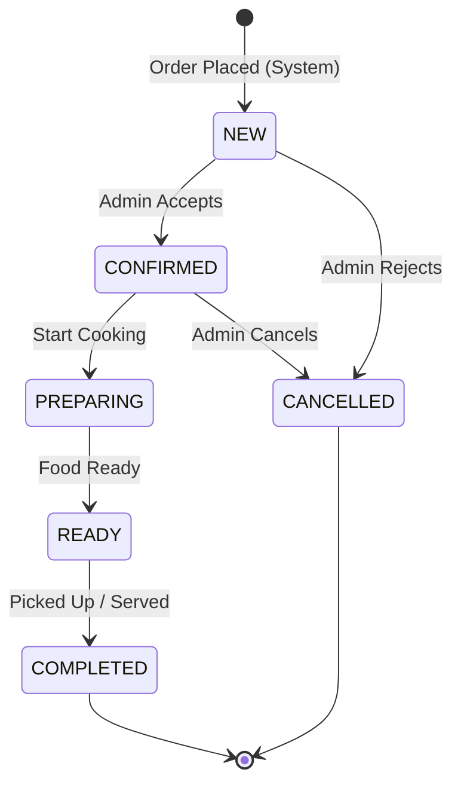

# Phase 5 — KDS, Order Flow & Real-time

---

## 1. Overview

The Kitchen Display System (KDS) and real-time order flow are essential for restaurant operations. The KDS is a **display-only** browser screen, and all order status updates are triggered by the **admin/counter** through Cloud Functions.

### Availability

| Feature | LITE | PRIME | SUPER |
|---------|------|-------|-------|
| KDS | ❌ | ✅ | ✅ |
| Order tokens | ❌ | ✅ | ✅ |
| Live order status | ❌ | ✅ | ✅ |
| Status flow (NEW → READY) | ❌ | ✅ | ✅ |
| Table indicators on KDS | ❌ | ❌ | ✅ |

---

## 2. Real-time Architecture

```
┌─────────────┐    Cloud Function     ┌────────────┐
│  Admin/      │ ──── HTTPS ────────→ │  Firestore │ (Source of truth)
│  Counter     │                      └────────────┘
└─────────────┘           │
                          │ Mirror
                          ▼
                   ┌──────────────┐
                   │    RTDB      │ (Live updates only)
                   │ live_orders/ │
                   └──────┬───────┘
                          │
            ┌─────────────┼─────────────┐
            │             │             │
            ▼             ▼             ▼
     ┌───────────┐ ┌───────────┐ ┌───────────┐
     │    KDS    │ │  Customer  │ │   Admin   │
     │  Screen   │ │  Tracker   │ │ Dashboard │
     └───────────┘ └───────────┘ └───────────┘
       (listens)    (listens)     (listens)
```

### Data Flow Rules
1. **Writes** always go through Cloud Functions → Firestore → RTDB mirror
2. **Reads** for live dashboards use RTDB listeners
3. **Reads** for historical data use Firestore directly
4. KDS is **read-only** — no interaction, display-only

---

## 3. RTDB Live Order Structure

```typescript
// Lightweight mirror — only data needed for display
interface RTDBLiveOrder {
  orderNumber: string;
  tokenNumber: number | null;
  type: 'TAKEAWAY' | 'DELIVERY' | 'DINE_IN';
  status: 'NEW' | 'CONFIRMED' | 'PREPARING' | 'READY' | 'COMPLETED' | 'CANCELLED';
  customer: {
    name: string;
    phone: string;
  };
  items: {
    name: string;
    quantity: number;
    variant: string | null;
    isVeg: boolean;
    addons?: string[];
    specialInstructions?: string;
  }[];
  totalAmount: number;
  placedAt: number;          // Unix timestamp ms
  table: {
    tableId: string;
    tableName: string;
  } | null;
  updatedAt: number;
}
```

---

## 4. Order Status Flow



### Status Transition Rules

```typescript
const VALID_TRANSITIONS: Record<string, string[]> = {
  NEW:       ['CONFIRMED', 'CANCELLED'],
  CONFIRMED: ['PREPARING', 'CANCELLED'],
  PREPARING: ['READY'],
  READY:     ['COMPLETED'],
  COMPLETED: [],  // Terminal state
  CANCELLED: [],  // Terminal state
};
```

### LITE Plan Behavior
On LITE plan, orders skip the status flow entirely:
- Order is placed as `NEW`
- Admin sees order in list
- No status transitions available
- No KDS display
- Orders are simply fulfilled manually

---

## 5. KDS Screen Design

**Route**: `/admin/kds`  
**Access**: PRIME and SUPER plans only  
**Behavior**: Full-screen, auto-refreshing, display-only

### KDS Layout

```
┌──────────────────────────────────────────────────────────────┐
│  🍽️ Kitchen Display — [Restaurant Name]    ⏰ 12:45 PM      │
├───────────────┬───────────────┬───────────────┬──────────────┤
│  🟡 NEW (3)   │ 🔵 PREPARING  │ 🟢 READY (2) │ ✅ DONE      │
├───────────────┼───────────────┼───────────────┼──────────────┤
│ ┌───────────┐ │ ┌───────────┐ │ ┌───────────┐ │              │
│ │ Token: 15 │ │ │ Token: 13 │ │ │ Token: 11 │ │              │
│ │ 📦 T/A    │ │ │ 🍽️ T-3    │ │ │ 📦 T/A    │ │              │
│ │ ───────── │ │ │ ───────── │ │ │ ───────── │ │              │
│ │ 2x B.Ch.  │ │ │ 1x Biryani│ │ │ 1x Thali  │ │              │
│ │ 1x Naan   │ │ │ 2x Naan   │ │ │ 2x Roti   │ │              │
│ │ 1x Raita  │ │ │ 1x Raita  │ │ │           │ │              │
│ │ ───────── │ │ │ ───────── │ │ │ ───────── │ │              │
│ │ 🕐 2m ago │ │ │ 🕐 5m ago │ │ │ 🕐 12m    │ │              │
│ └───────────┘ │ └───────────┘ │ └───────────┘ │              │
│ ┌───────────┐ │ ┌───────────┐ │ ┌───────────┐ │              │
│ │ Token: 16 │ │ │ Token: 14 │ │ │ Token: 12 │ │              │
│ │ 🚗 DEL    │ │ │ 📦 T/A    │ │ │ 🚗 DEL    │ │              │
│ │ ───────── │ │ │ ───────── │ │ │ ───────── │ │              │
│ │ 1x Pizza  │ │ │ 3x Dosa   │ │ │ 2x Burger │ │              │
│ │ ───────── │ │ │ ───────── │ │ │ ───────── │ │              │
│ │ 🕐 <1m    │ │ │ 🕐 3m ago │ │ │ 🕐 10m    │ │              │
│ └───────────┘ │ └───────────┘ │ └───────────┘ │              │
└───────────────┴───────────────┴───────────────┴──────────────┘
```

### KDS Card Elements

| Element | Description |
|---------|-------------|
| Token Number | Large, prominent display |
| Order Type | 📦 Takeaway, 🚗 Delivery, 🍽️ Dine-in (T-{tableId}) |
| Items | Name, quantity, variant |
| Special Instructions | Highlighted in yellow |
| Time since placed | Auto-updates, turns red after threshold |
| Veg/Non-veg | Color-coded dots |

### KDS Behavior
- **Auto-scrolls** if too many orders in a column
- **Sound notification** when new order arrives
- **Color coding** — time-based urgency (green → yellow → red)
- **Auto-removes** completed/cancelled orders after 5 minutes
- **Responsive** — works on tablets, TVs, and desktops

---

## 6. Real-time Listener Implementation

### KDS Listener (Frontend)

```typescript
// hooks/useKDSOrders.ts

import { ref, onValue, off } from 'firebase/database';

export function useKDSOrders(restaurantId: string) {
  const [orders, setOrders] = useState<Record<string, RTDBLiveOrder>>({});
  
  useEffect(() => {
    const ordersRef = ref(rtdb, `live_orders/${restaurantId}`);
    
    const unsubscribe = onValue(ordersRef, (snapshot) => {
      const data = snapshot.val();
      if (data) {
        // Filter to only active orders (not completed/cancelled > 5 min)
        const activeOrders = filterActiveOrders(data);
        setOrders(activeOrders);
      } else {
        setOrders({});
      }
    });
    
    return () => off(ordersRef);
  }, [restaurantId]);
  
  // Group by status
  const grouped = {
    new: Object.values(orders).filter(o => o.status === 'NEW'),
    confirmed: Object.values(orders).filter(o => o.status === 'CONFIRMED'),
    preparing: Object.values(orders).filter(o => o.status === 'PREPARING'),
    ready: Object.values(orders).filter(o => o.status === 'READY'),
  };
  
  return { orders, grouped };
}
```

### Admin Order Notifications

```typescript
// hooks/useOrderNotifications.ts

export function useOrderNotifications(restaurantId: string) {
  const prevCountRef = useRef(0);
  const audioRef = useRef(new Audio('/sounds/new-order.mp3'));
  
  useEffect(() => {
    const ordersRef = ref(rtdb, `live_orders/${restaurantId}`);
    
    onValue(ordersRef, (snapshot) => {
      const data = snapshot.val();
      if (!data) return;
      
      const newOrders = Object.values(data).filter(
        (o: any) => o.status === 'NEW'
      );
      
      // Play sound if new orders appeared
      if (newOrders.length > prevCountRef.current) {
        audioRef.current.play().catch(() => {});
        
        // Browser notification
        if (Notification.permission === 'granted') {
          new Notification('New Order!', {
            body: `Token #${newOrders[0].tokenNumber} — ${newOrders[0].type}`,
            icon: '/favicon.png',
          });
        }
      }
      
      prevCountRef.current = newOrders.length;
    });
  }, [restaurantId]);
}
```

---

## 7. RTDB Cleanup

Completed and cancelled orders should be cleaned from RTDB to minimize costs:

```typescript
// functions/src/orders/cleanupRTDB.ts

export const cleanupOldOrders = functions.pubsub
  .schedule('every 30 minutes')
  .onRun(async () => {
    const cutoff = Date.now() - (60 * 60 * 1000); // 1 hour ago
    
    const snapshot = await admin.database()
      .ref('live_orders')
      .once('value');
    
    const updates = {};
    
    snapshot.forEach((restaurantSnap) => {
      restaurantSnap.forEach((orderSnap) => {
        const order = orderSnap.val();
        if (
          ['COMPLETED', 'CANCELLED'].includes(order.status) &&
          order.updatedAt < cutoff
        ) {
          updates[`live_orders/${restaurantSnap.key}/${orderSnap.key}`] = null;
        }
      });
    });
    
    if (Object.keys(updates).length > 0) {
      await admin.database().ref().update(updates);
    }
  });
```

---

## 8. Token Number System

```typescript
// functions/src/orders/tokenGenerator.ts

export async function generateToken(restaurantId: string): Promise<number> {
  const today = new Date().toISOString().split('T')[0]; // "2026-02-10"
  const counterRef = admin.firestore()
    .collection('restaurants')
    .doc(restaurantId)
    .collection('counters')
    .doc(`token_${today}`);
  
  const result = await admin.firestore().runTransaction(async (tx) => {
    const doc = await tx.get(counterRef);
    const current = doc.exists ? doc.data()!.value : 0;
    const next = current + 1;
    tx.set(counterRef, { value: next, date: today });
    return next;
  });
  
  return result;
}
```

Token resets daily at midnight (new document per day).

---

## 9. Staff Call Button (SUPER — Dine-in)

For SUPER plan dine-in customers, a "Call Waiter" button appears on the customer ordering page:

| Feature | Description |
|---------|-------------|
| Trigger | Customer taps "🔔 Call Waiter" button |
| Notification | Appears on KDS and admin dashboard |
| Info displayed | Table number, time called |
| Acknowledgement | Staff taps "Acknowledge" to dismiss |
| Cooldown | 2-minute cooldown to prevent spam |

Waiter call events are written to RTDB under `waiter_calls/{restaurantId}/{callId}`.

---

## 10. KDS Category Filtering

For restaurants with separate kitchen stations (drinks bar, food kitchen, desserts):

| Feature | Description |
|---------|-------------|
| Filter by category | Show only items from selected categories |
| Multi-screen | Different tablets can show different categories |
| Configuration | Admin selects which categories each KDS screen displays |
| URL parameter | `?filter=Beverages,Desserts` for easy setup |

---

## 11. Implementation Checklist

- [ ] Build KDS screen
  - [ ] Kanban-style column layout (NEW | PREPARING | READY)
  - [ ] Order cards with token, type, items
  - [ ] Auto-refresh via RTDB listeners
  - [ ] Sound notifications for new orders
  - [ ] Time-based urgency colors
  - [ ] Full-screen / TV mode
  - [ ] Responsive for tablet
  - [ ] Category filtering (URL parameter based)
- [ ] Implement staff call button (SUPER dine-in)
  - [ ] Customer-side call button with cooldown
  - [ ] RTDB event for waiter calls
  - [ ] KDS/admin notification display
  - [ ] Acknowledge & dismiss flow
- [ ] Implement RTDB mirroring in order Cloud Functions
- [ ] Build real-time order notification system
  - [ ] Browser notifications
  - [ ] Sound alerts
  - [ ] Badge counts
- [ ] Implement order status update Cloud Function
  - [ ] Status transition validation
  - [ ] Firestore + RTDB dual update
  - [ ] Timestamp recording
- [ ] Implement token number generator
- [ ] Build RTDB cleanup scheduler
- [ ] Implement customer order tracking page
- [ ] Test real-time latency (<500ms target)
- [ ] Test KDS on actual tablet/TV browser
- [ ] Stress test with concurrent orders

---

> **Previous**: [← Phase 4 — Customer Ordering](./phase-4-customer-ordering.md)  
> **Next**: [Phase 6 — Billing, Payments & Subscriptions →](./phase-6-billing-payments.md)
