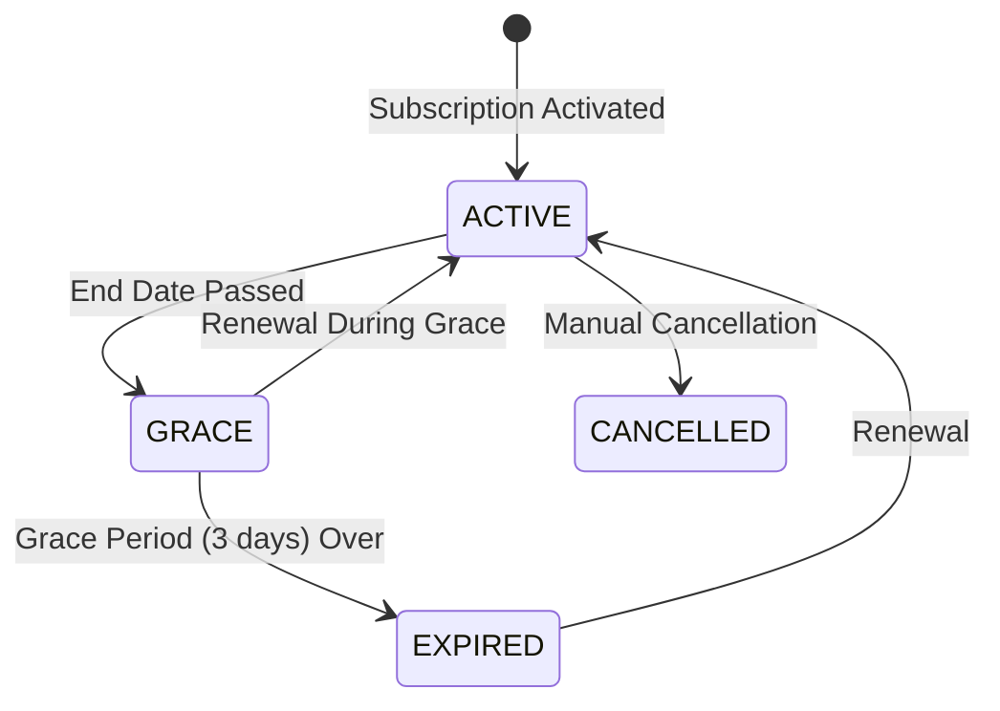

# Phase 6 — Billing, Payments & Subscriptions

---

## 1. Digital Bill System

QRSeva supports two tiers of digital bills, gated by subscription plan.

### 1.1 Bill Tier Comparison

| Element | Basic Bill (PRIME) | Full Bill (SUPER) |
|---------|-------------------|-------------------|
| Order number | ✅ | ✅ |
| Date & time | ✅ | ✅ |
| Item list | ✅ | ✅ |
| Total amount | ✅ | ✅ |
| Payment mode | ✅ | ✅ |
| Restaurant name | ❌ | ✅ |
| Restaurant address | ❌ | ✅ |
| Restaurant phone | ❌ | ✅ |
| Table number | ❌ | ✅ |
| GSTIN | ❌ | ✅ (if provided) |
| CGST/SGST breakdown | ❌ | ✅ (if GSTIN provided) |
| Coupon discount | ✅ | ✅ |
| Footer | ❌ | "Powered by QRSeva" |

> **Important**: The bill is NOT a legal GST invoice. The CGST/SGST breakdown is for informational purposes. No QRSeva GST number or signature is included.

### 1.2 Bill Generation

```typescript
// functions/src/billing/generateBill.ts

interface BillData {
  // Basic bill (PRIME)
  orderNumber: string;
  date: string;
  time: string;
  items: { name: string; qty: number; price: number; total: number }[];
  subtotal: number;
  deliveryCharge: number;
  discount: number;
  totalAmount: number;
  paymentMode: string;
  
  // Full bill additions (SUPER)
  restaurantName?: string;
  restaurantAddress?: string;
  restaurantPhone?: string;
  tableName?: string;
  gstin?: string;
  cgst?: number;                 // Central GST (2.5% of taxable amount)
  sgst?: number;                 // State GST (2.5% of taxable amount)
  couponCode?: string;           // Applied coupon code
  couponDiscount?: number;       // Coupon discount amount
  footer?: string;
}

export const generateBill = functions.https.onCall(async (data, context) => {
  requireRestaurantAdmin(context);
  const { orderId } = data;
  const restaurantId = context.auth.token.restaurantId;
  
  // 1. Fetch order & restaurant
  const order = await getOrder(orderId, restaurantId);
  const restaurant = await getRestaurant(restaurantId);
  
  // 2. Check plan allows billing
  if (restaurant.currentPlan === 'LITE') {
    throw error('Digital billing requires PRIME or SUPER plan');
  }
  
  // 3. Build bill data
  const bill: BillData = {
    orderNumber: order.orderNumber,
    date: formatDate(order.placedAt),
    time: formatTime(order.placedAt),
    items: order.items.map(item => ({
      name: item.name + (item.variant ? ` (${item.variant})` : ''),
      qty: item.quantity,
      price: item.price / 100,
      total: item.itemTotal / 100,
    })),
    subtotal: order.subtotal / 100,
    deliveryCharge: order.deliveryCharge / 100,
    discount: order.discount / 100,
    totalAmount: order.totalAmount / 100,
    paymentMode: order.payment.mode,
  };
  
  // 4. Add full bill details for SUPER
  if (restaurant.currentPlan === 'SUPER') {
    bill.restaurantName = restaurant.name;
    bill.restaurantAddress = formatAddress(restaurant.address);
    bill.restaurantPhone = restaurant.phone;
    bill.tableName = order.table?.tableName || null;
    bill.gstin = restaurant.gstin || null;
    bill.footer = 'Powered by QRSeva';
  }
  
  return bill;
});
```

### 1.3 Bill Template (HTML for Print)

```
┌─────────────────────────────────┐
│      [Restaurant Logo]          │  ← SUPER only
│    RESTAURANT NAME              │  ← SUPER only
│    Address Line 1, City         │  ← SUPER only
│    Phone: +91-XXXXXXXXXX        │  ← SUPER only
│    GSTIN: XXXXXXXXXXXX          │  ← SUPER only
│  ─────────────────────────────  │
│  Order: ORD-20260210-015        │
│  Date: 10 Feb 2026 | 12:45 PM  │
│  Table: Table 3                 │  ← SUPER + dine-in
│  Type: Dine-in                  │
│  ─────────────────────────────  │
│  ITEM              QTY  AMOUNT  │
│  ─────────────────────────────  │
│  Butter Chicken(F)  1   ₹350   │
│  Garlic Naan        2   ₹120   │
│  Dal Makhani        1   ₹220   │
│  Raita              1    ₹40   │
│  ─────────────────────────────  │
│  Subtotal:              ₹730   │
│  Delivery Charge:        ₹40   │
│  Discount:               -₹0   │
│  ─────────────────────────────  │
│  TOTAL:                 ₹770   │
│  ─────────────────────────────  │
│  Payment: Cash                  │
│  Status: Collected              │
│  ─────────────────────────────  │
│                                  │
│      Powered by QRSeva          │  ← SUPER only
└─────────────────────────────────┘
```

---

## 2. Payment Collection

### 2.1 Payment Modes

| Mode | Description | Plan |
|------|-------------|------|
| Cash | Pay at counter | All |
| UPI | External UPI (manual) | All |
| Pay on Pickup | Pay when collecting order | All |
| Online | Via Cashfree/Razorpay | Add-on |

### 2.2 Counter Payment Collection

Admin marks payment as collected from the order detail screen:

```typescript
// functions/src/payments/collectPayment.ts

export const collectPayment = functions.https.onCall(async (data, context) => {
  requireRestaurantAdmin(context);
  const { orderId, paymentMode } = data;
  const restaurantId = context.auth.token.restaurantId;
  
  const orderRef = admin.firestore().collection('orders').doc(orderId);
  const order = await orderRef.get();
  
  if (!order.exists || order.data()!.restaurantId !== restaurantId) {
    throw error('Order not found');
  }
  
  await orderRef.update({
    'payment.status': 'COLLECTED',
    'payment.mode': paymentMode,
    'payment.collectedAt': admin.firestore.FieldValue.serverTimestamp(),
    'payment.collectedBy': 'COUNTER',
    updatedAt: admin.firestore.FieldValue.serverTimestamp(),
  });
  
  // Update daily payment counters
  await updateDailyPaymentReport(restaurantId, paymentMode, order.data()!.totalAmount);
  
  return { success: true };
});
```

### 2.3 Waiter-Assisted Payment (SUPER Only)

For dine-in orders on SUPER plan, a time-bound payment link can be generated:

```typescript
// functions/src/payments/generatePaymentLink.ts

export const generateWaiterPaymentLink = functions.https.onCall(async (data, context) => {
  requireRestaurantAdmin(context);
  const restaurantId = context.auth.token.restaurantId;
  
  // Check SUPER plan
  const restaurant = await getRestaurant(restaurantId);
  if (restaurant.currentPlan !== 'SUPER') {
    throw error('Waiter payment link requires SUPER plan');
  }
  
  const { orderId } = data;
  
  // Generate a secure, time-bound token (expires in 30 min)
  const token = generateSecureToken();
  const expiresAt = new Date(Date.now() + 30 * 60 * 1000);
  
  // Store token
  await admin.firestore()
    .collection('payment_links')
    .doc(token)
    .set({
      orderId,
      restaurantId,
      token,
      expiresAt: admin.firestore.Timestamp.fromDate(expiresAt),
      used: false,
      createdAt: admin.firestore.FieldValue.serverTimestamp(),
    });
  
  const link = `https://pay.qrseva.in/${token}`;
  
  return { link, expiresAt: expiresAt.toISOString() };
});
```

---

## 3. Online Payment Add-on

### 3.1 Architecture

```
Customer → Cloud Function → Cashfree/Razorpay API → Payment Gateway
                                      │
                                      ▼
                              Webhook → Cloud Function
                                      │
                                      ▼
                              Update Firestore order
                              Update RTDB mirror
```

### 3.2 Payment Flow

```typescript
// functions/src/payments/initiateOnlinePayment.ts

export const initiateOnlinePayment = functions.https.onCall(async (data, context) => {
  const { orderId, restaurantId } = data;
  
  // 1. Verify restaurant has online payment add-on
  const subscription = await getActiveSubscription(restaurantId);
  if (!subscription.addons.onlinePayment) {
    throw error('Online payment not enabled');
  }
  
  // 2. Fetch order
  const order = await getOrder(orderId, restaurantId);
  
  // 3. Create payment session with gateway
  const session = await paymentGateway.createSession({
    orderId: order.orderNumber,
    amount: order.totalAmount / 100, // Convert paisa to rupees
    currency: 'INR',
    customerName: order.customer.name,
    customerPhone: order.customer.phone,
    returnUrl: `https://order.qrseva.in/payment/callback`,
    notifyUrl: `https://us-central1-qrseva-prod.cloudfunctions.net/paymentWebhook`,
  });
  
  // 4. Store session reference
  await admin.firestore().collection('orders').doc(orderId).update({
    'payment.sessionId': session.id,
    'payment.gatewayOrderId': session.gatewayOrderId,
  });
  
  return { paymentUrl: session.paymentUrl };
});

// Webhook handler
export const paymentWebhook = functions.https.onRequest(async (req, res) => {
  // 1. Verify webhook signature
  const isValid = paymentGateway.verifyWebhook(req.body, req.headers);
  if (!isValid) return res.status(400).send('Invalid signature');
  
  // 2. Update order payment status
  const { orderId, status, transactionId } = req.body;
  
  if (status === 'SUCCESS') {
    await admin.firestore().collection('orders').doc(orderId).update({
      'payment.status': 'COLLECTED',
      'payment.transactionId': transactionId,
      'payment.collectedAt': admin.firestore.FieldValue.serverTimestamp(),
      'payment.collectedBy': 'ONLINE',
    });
  }
  
  res.status(200).send('OK');
});
```

---

## 4. Subscription Management (Admin View)

### 4.1 Subscription States



### 4.2 Impact on Operations

| State | Order Placement | Admin Dashboard | Reports |
|-------|----------------|-----------------|---------|
| ACTIVE | ✅ Allowed | ✅ Full access | ✅ Available |
| GRACE | ✅ Allowed (warning) | ✅ With banner | ✅ Available |
| EXPIRED | ❌ Blocked | ⚠️ Read-only + renew CTA | ❌ Frozen |
| CANCELLED | ❌ Blocked | ⚠️ Read-only + contact CTA | ❌ Frozen |

### 4.3 Grace Period Banner

```
┌──────────────────────────────────────────────────────────────┐
│ ⚠️ Your subscription expired on 08 Feb 2026. You have 2     │
│ days remaining in the grace period. Contact sales to renew.  │
│                                          [Contact Sales →]   │
└──────────────────────────────────────────────────────────────┘
```

---

## 5. Implementation Checklist

- [ ] Build bill generation Cloud Function
  - [ ] Basic bill (PRIME)
  - [ ] Full bill (SUPER)
- [ ] Create printable bill HTML template
  - [ ] Responsive print CSS
  - [ ] "Print Bill" button on order detail
- [ ] Implement payment collection
  - [ ] Counter payment marking
  - [ ] Payment mode recording
  - [ ] Daily payment report update
- [ ] Implement waiter payment link (SUPER)
  - [ ] Secure token generation
  - [ ] Time-bound expiry (30 min)
  - [ ] Payment link landing page
- [ ] Integrate online payment gateway (Add-on)
  - [ ] Cashfree SDK integration
  - [ ] Payment session creation
  - [ ] Webhook handler
  - [ ] Payment confirmation flow
- [ ] Build subscription info page for admin
  - [ ] Plan details display
  - [ ] Expiry countdown
  - [ ] Grace period warning
  - [ ] Contact sales CTA
- [ ] Implement subscription state checks in all Cloud Functions
- [ ] Build GST calculation on bills
  - [ ] CGST/SGST breakdown (2.5% each for 5% tax category)
  - [ ] Conditional on restaurant having GSTIN
  - [ ] Tax summary row on printed bill
- [ ] Build subscription invoice generation
  - [ ] Auto-generate invoice on subscription activation
  - [ ] Sequential invoice numbering (INV-2026-XXXXX)
  - [ ] Downloadable PDF invoice for restaurant
  - [ ] Invoice listing in admin subscription page
- [ ] Test expired subscription blocking
- [ ] Test grace period behavior
- [ ] Test bill generation for both plans
- [ ] Test GST calculation accuracy

---

> **Previous**: [← Phase 5 — KDS, Orders & Real-time](./phase-5-kds-orders-realtime.md)  
> **Next**: [Phase 7 — Reports, Analytics & Add-ons →](./phase-7-reports-analytics.md)
