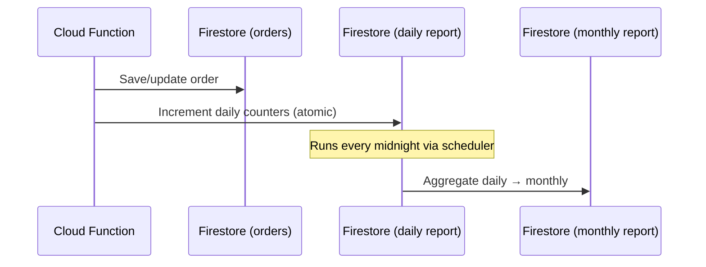
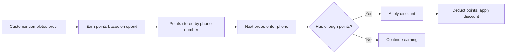

# Phase 7 — Reports, Analytics & Add-ons

---

## 1. Reporting Architecture

Reports are **precomputed** — never raw aggregation at read time. Every order event (placement, completion, cancellation, payment) atomically updates the relevant report counters.

### Availability Matrix

| Feature | LITE | PRIME | SUPER |
|---------|------|-------|-------|
| Daily reports | ❌ | ✅ | ✅ |
| Monthly reports | ❌ | ✅ | ✅ |
| Top-selling items | ❌ | ✅ | ✅ |
| Revenue by type | ❌ | ✅ | ✅ |
| Peak hours analysis | ❌ | ❌ | ✅ |
| Trend analysis | ❌ | ❌ | ✅ |
| Item popularity ranking | ❌ | ❌ | ✅ |
| Customer frequency (future) | ❌ | ❌ | ✅ |
| Combo deals | ❌ | ❌ | ✅ |
| Loyalty program | ❌ | ❌ | ✅ |

---

## 2. Report Update Flow



### 2.1 Atomic Counter Updates on Order Events

```typescript
// functions/src/reports/updateReportCounters.ts

export async function incrementDailyOrderCount(
  restaurantId: string,
  order: Order,
  event: 'PLACED' | 'COMPLETED' | 'CANCELLED'
) {
  const today = new Date().toISOString().split('T')[0];
  const reportRef = admin.firestore()
    .collection('reports')
    .doc(restaurantId)
    .collection('daily')
    .doc(today);

  const hour = new Date().getHours();

  const updates: Record<string, any> = {
    restaurantId,
    date: today,
    updatedAt: admin.firestore.FieldValue.serverTimestamp(),
  };

  if (event === 'PLACED') {
    updates['orders.total'] = FieldValue.increment(1);
    updates[`orders.byType.${order.type.toLowerCase()}`] = FieldValue.increment(1);
    updates[`peakHours.${hour}`] = FieldValue.increment(1);
  }

  if (event === 'COMPLETED') {
    updates['orders.byStatus.completed'] = FieldValue.increment(1);
    updates['revenue.total'] = FieldValue.increment(order.totalAmount);
    updates[`revenue.byType.${order.type.toLowerCase()}`] = FieldValue.increment(order.totalAmount);
    updates['revenue.deliveryCharges'] = FieldValue.increment(order.deliveryCharge);
    updates['revenue.discounts'] = FieldValue.increment(order.discount);
    updates['items.totalItemsSold'] = FieldValue.increment(
      order.items.reduce((sum, i) => sum + i.quantity, 0)
    );
  }

  if (event === 'CANCELLED') {
    updates['orders.byStatus.cancelled'] = FieldValue.increment(1);
  }

  await reportRef.set(updates, { merge: true });
}
```

### 2.2 Top-Selling Items Update

```typescript
// functions/src/reports/updateTopItems.ts

export async function updateTopSellingItems(
  restaurantId: string,
  order: Order
) {
  const today = new Date().toISOString().split('T')[0];
  const itemStatsRef = admin.firestore()
    .collection('reports')
    .doc(restaurantId)
    .collection('item_stats')
    .doc(today);

  // Increment per-item counters
  const batch = admin.firestore().batch();
  for (const item of order.items) {
    const key = item.menuItemId;
    batch.set(itemStatsRef, {
      [`items.${key}.name`]: item.name,
      [`items.${key}.quantity`]: FieldValue.increment(item.quantity),
      [`items.${key}.revenue`]: FieldValue.increment(item.itemTotal),
    }, { merge: true });
  }
  await batch.commit();
}
```

### 2.3 Monthly Aggregation (Scheduled)

```typescript
// functions/src/reports/aggregateMonthly.ts

export const aggregateMonthlyReports = functions.pubsub
  .schedule('0 1 1 * *')  // 1 AM on 1st of every month
  .timeZone('Asia/Kolkata')
  .onRun(async () => {
    const lastMonth = getLastMonth(); // "2026-01"
    
    const restaurants = await admin.firestore()
      .collection('restaurants')
      .where('isActive', '==', true)
      .get();

    for (const restaurant of restaurants.docs) {
      const rid = restaurant.id;
      const plan = restaurant.data().currentPlan;
      
      if (plan === 'LITE') continue; // No reports for LITE

      const dailyReports = await admin.firestore()
        .collection('reports').doc(rid)
        .collection('daily')
        .where('date', '>=', `${lastMonth}-01`)
        .where('date', '<=', `${lastMonth}-31`)
        .get();

      const monthly = aggregateDailyToMonthly(dailyReports.docs, plan);

      await admin.firestore()
        .collection('reports').doc(rid)
        .collection('monthly').doc(lastMonth)
        .set(monthly);
    }
  });
```

---

## 3. Reports UI

### 3.1 Daily Report Screen

**Route**: `/admin/reports/daily`

```
┌──────────────────────────────────────────────────────┐
│  📈 Daily Report           [◀ Feb 9] Feb 10 [▶]     │
├──────────────────────────────────────────────────────┤
│                                                      │
│  ┌──────────┐ ┌──────────┐ ┌──────────┐ ┌─────────┐│
│  │ Orders   │ │ Revenue  │ │ Avg Order│ │ Items   ││
│  │   47     │ │ ₹23,450  │ │ ₹499     │ │  142    ││
│  │ +12% ↑   │ │ +8% ↑    │ │ -2% ↓    │ │ +15% ↑  ││
│  └──────────┘ └──────────┘ └──────────┘ └─────────┘│
│                                                      │
│  ORDER BREAKDOWN           REVENUE BY TYPE           │
│  ┌──────────────┐         ┌──────────────┐          │
│  │  🥡 T/A: 28  │         │  🥡 ₹12,300  │          │
│  │  🚗 Del: 15  │         │  🚗  ₹8,650  │          │
│  │  🍽️ Din:  4  │         │  🍽️  ₹2,500  │          │
│  │  ✅ Done: 42 │         │              │          │
│  │  ❌ Canc:  5 │         │              │          │
│  └──────────────┘         └──────────────┘          │
│                                                      │
│  TOP SELLING ITEMS                                   │
│  ┌──────────────────────────────────────────┐       │
│  │ 1. Butter Chicken  — 32 sold — ₹11,200  │       │
│  │ 2. Garlic Naan     — 28 sold —  ₹1,680  │       │
│  │ 3. Biryani (Full)  — 18 sold —  ₹5,400  │       │
│  │ 4. Paneer Tikka    — 15 sold —  ₹3,750  │       │
│  │ 5. Dal Makhani     — 12 sold —  ₹2,640  │       │
│  └──────────────────────────────────────────┘       │
│                                                      │
│  PAYMENT BREAKDOWN                                   │
│  Cash: ₹8,200 | UPI: ₹12,450 | Online: ₹2,800     │
│                                                      │
│  PEAK HOURS (SUPER only)                             │
│  ┌──────────────────────────────────────┐            │
│  │  ▓▓░░░░▓▓▓▓▓▓▓▓▓▓░░▓▓▓▓▓▓▓▓░░░░   │            │
│  │  6  8  10 12  2  4  6  8  10 12     │            │
│  └──────────────────────────────────────┘            │
└──────────────────────────────────────────────────────┘
```

### 3.2 Monthly Report Screen

**Route**: `/admin/reports/monthly`

- Month selector
- Aggregated metrics
- Revenue trend chart (week-by-week)
- Growth vs. previous month (%)
- Top items of the month
- Peak days analysis (SUPER)
- Export to CSV/PDF (future)

---

## 4. Combo Deals (SUPER Only)

### 4.1 Data Model

```typescript
interface ComboDeal {
  id: string;
  restaurantId: string;
  name: string;                // "Family Feast"
  description?: string;
  items: {
    menuItemId: string;
    name: string;
    quantity: number;
    variant?: string;
  }[];
  originalPrice: number;       // Sum of individual items (paisa)
  comboPrice: number;          // Discounted price (paisa)
  discount: number;            // Savings (paisa)
  imageUrl?: string;
  isActive: boolean;
  validFrom?: Timestamp;
  validUntil?: Timestamp;
  maxPerOrder: number;         // Max combos per order
  displayOrder: number;
  createdAt: Timestamp;
  updatedAt: Timestamp;
}
```

### 4.2 Combo Management UI

**Route**: `/admin/combos`

| Feature | Description |
|---------|-------------|
| Create Combo | Select items, set combo price, upload image |
| Edit Combo | Modify items, pricing, availability |
| Toggle Active | Enable/disable combo |
| Set Validity | Optional start/end dates |
| Order Limit | Max combos per order |
| Preview | Customer-facing preview |

### 4.3 Customer View

Combos appear as a special category at the top of the menu:

```
┌──────────────────────────────────┐
│  🎁 COMBO DEALS                  │
│  ─────────────────────────────── │
│  ┌────────────────────────────┐  │
│  │ 🍗 Family Feast            │  │
│  │ 2x Butter Chicken (Full)   │  │
│  │ 4x Garlic Naan             │  │
│  │ 2x Raita                   │  │
│  │ ₹̶9̶4̶0̶  ₹799  Save ₹141!   │  │
│  │         [Add to Cart]      │  │
│  └────────────────────────────┘  │
└──────────────────────────────────┘
```

---

## 5. Loyalty Program (SUPER Only)

### 5.1 Data Model

```typescript
interface LoyaltyConfig {
  restaurantId: string;
  isEnabled: boolean;
  pointsPerRupee: number;       // e.g., 1 point per ₹10 spent
  redemptionRate: number;        // e.g., 100 points = ₹10 discount
  minimumRedemption: number;     // Min points to redeem
  maximumDiscount: number;       // Max discount per order (paisa)
  welcomePoints: number;         // Points for first order
}

interface CustomerLoyalty {
  id: string;                    // phone number hash
  restaurantId: string;
  phone: string;
  totalPoints: number;
  availablePoints: number;
  totalOrders: number;
  totalSpent: number;            // paisa
  history: {
    orderId: string;
    type: 'EARNED' | 'REDEEMED';
    points: number;
    date: Timestamp;
  }[];
  createdAt: Timestamp;
  updatedAt: Timestamp;
}
```

### 5.2 Loyalty Flow



### 5.3 Points Calculation

```typescript
function calculateLoyaltyPoints(
  totalAmount: number,
  config: LoyaltyConfig
): number {
  // totalAmount in paisa, config.pointsPerRupee = points per ₹1
  const rupees = totalAmount / 100;
  return Math.floor(rupees * config.pointsPerRupee / 10);
}

function calculateRedemptionDiscount(
  points: number,
  config: LoyaltyConfig
): number {
  // Convert points to paisa discount
  const discount = (points / config.redemptionRate) * 1000; // paisa
  return Math.min(discount, config.maximumDiscount);
}
```

---

## 6. Tax Reports (GST Filing) — SUPER

Generate tax-specific reports for restaurant's GST filing:

| Report | Description |
|--------|-------------|
| Monthly GST Summary | Total taxable amount, CGST, SGST collected |
| HSN-wise Summary | Tax breakdown by HSN code (if configured) |
| B2C Summary | Aggregate consumer sales |
| Export as PDF/Excel | Downloadable format for CA / accountant |

### Report Fields
- Total Sales (inclusive of tax)
- Taxable Value
- CGST @ 2.5%
- SGST @ 2.5%
- Total Tax Collected
- Exempt Sales (if any)

---

## 7. Customer Analytics — SUPER

| Feature | Description |
|---------|-------------|
| Repeat Customer Rate | % of orders from returning phone numbers |
| Customer Frequency | Orders per customer per month |
| Average Order Value | Per customer and overall |
| Customer Segmentation | New, Regular (2-5 orders), Loyal (5+) |
| Top Customers | Leaderboard by order count and spend |
| Feedback Summary | Average rating, common tags, trends |

Data is derived from order history, matched by `customer.phone`.

---

## 8. Menu Engineering Matrix — SUPER

Categorize menu items by popularity and profitability:

| Quadrant | Popularity | Margin | Action |
|----------|-----------|--------|--------|
| ⭐ Stars | High | High | Promote prominently |
| 🐴 Plow Horses | High | Low | Consider price increase |
| 🧩 Puzzles | Low | High | Better placement/marketing |
| 🐕 Dogs | Low | Low | Consider removing |

Based on: order count (popularity) and configurable cost price vs selling price (margin).

---

## 9. Coupon / Promo Code System

### 9.1 Plan Availability

| Feature | LITE | PRIME | SUPER |
|---------|------|-------|-------|
| Create coupons | ❌ | ✅ (5 active) | ✅ (unlimited) |
| Usage analytics | ❌ | Basic | Detailed |
| Auto-apply coupons | ❌ | ❌ | ✅ |

### 9.2 Admin Management

Admin can create, edit, deactivate coupons:
- Flat or percentage discount
- Minimum order amount
- Max discount cap
- Usage limits (total + per-customer)
- Valid date range
- Applicable order types

### 9.3 Customer Flow

1. Customer enters coupon code at checkout
2. Cloud Function validates: active, within dates, usage limit, min order
3. Discount applied to order total
4. Coupon usage recorded

---

## 10. Implementation Checklist

- [ ] Build report counter update system
  - [ ] On order placed
  - [ ] On order completed
  - [ ] On order cancelled
  - [ ] On payment collected
- [ ] Build daily report UI screen
  - [ ] Summary cards
  - [ ] Order breakdown chart
  - [ ] Revenue by type
  - [ ] Top-selling items table
  - [ ] Payment breakdown
  - [ ] Peak hours chart (SUPER)
- [ ] Build monthly report UI
  - [ ] Aggregated metrics
  - [ ] Revenue trend chart
  - [ ] Growth comparison
- [ ] Implement monthly aggregation scheduler
- [ ] Build top-selling items tracking
- [ ] Build tax reports (SUPER)
  - [ ] Monthly GST summary
  - [ ] Export as PDF/Excel
- [ ] Build customer analytics (SUPER)
  - [ ] Repeat customer tracking
  - [ ] Customer segmentation
  - [ ] Top customers leaderboard
  - [ ] Feedback summary
- [ ] Build menu engineering matrix (SUPER)
  - [ ] Popularity + margin calculation
  - [ ] Visual quadrant display
- [ ] Implement coupon/promo code system
  - [ ] Coupon CRUD Cloud Functions
  - [ ] Admin coupon management UI
  - [ ] Customer coupon validation at checkout
  - [ ] Coupon usage tracking & analytics
- [ ] Implement Combo Deals (SUPER)
  - [ ] Firestore model
  - [ ] CRUD Cloud Functions
  - [ ] Admin management UI
  - [ ] Customer menu integration
  - [ ] Order validation for combos
- [ ] Implement Loyalty Program (SUPER)
  - [ ] Config management
  - [ ] Points earning on order completion
  - [ ] Points redemption at checkout
  - [ ] Customer loyalty lookup by phone
  - [ ] Admin loyalty dashboard
- [ ] Test report accuracy with sample orders
- [ ] Test combo pricing validation
- [ ] Test loyalty points calculation
- [ ] Test coupon validation edge cases
- [ ] Test tax report calculation

---

> **Previous**: [← Phase 6 — Billing, Payments & Subscriptions](./phase-6-billing-payments.md)  
> **Next**: [Phase 8 — Landing Page & Public Website →](./phase-8-landing-page.md)
